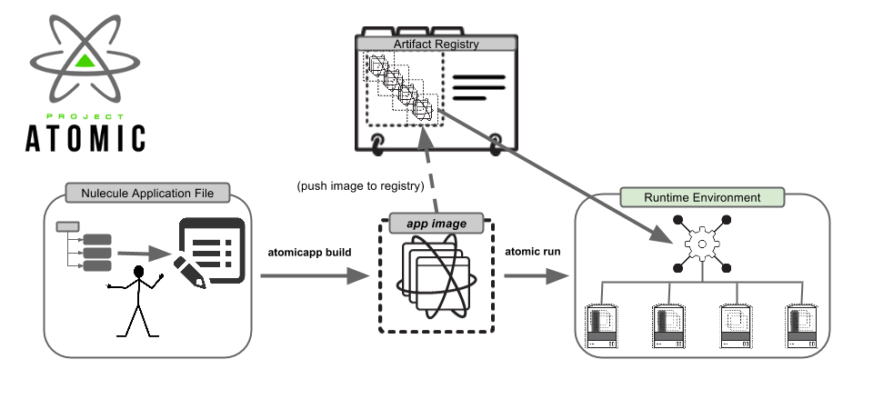

# Atomic App



Atomic App is a reference implementation of the [Nulecule](docs/spec/README.md) specification. Packaged Atomic App containers are "Nuleculized" and each component of the package is a "Nulecule".

Atomic App is used to bootstrap packaged container environments and run them on multiple container orchestrators. It is designed from the ground-up to be portable and provider pluggable.

  - __A "packaged installer" for all container-based environments and applications.__ Replace all those bash and Ansible scripts with one container-based deployment tool.

  - __Target multiple providers:__ Specify the provider you want the Atomic App to run on. It supports Kubernetes, OpenShift, Mesos+Marathon and Docker.

  - __Inherit already packaged containers:__ Create composite applications by referencing other Nulecule-compliant applications. For example, plugging in an alternative well-orchestrated database in another referenced container image.

  - __Fetch and run entire environments:__ Use `atomicapp fetch` and `atomicapp run` to run pre-packaged Nuleculized containers.

## Installing Atomic App
From Linux:
```sh
git clone https://github.com/projectatomic/atomicapp && cd atomicapp
sudo make install
```

_or_ 

Download a pre-signed .tar.gz from [download.projectatomic.io](https://download.projectatomic.io) / [GitHub](https://github.com/projectatomic/atomicapp/releases):
```sh
export RELEASE=0.6.4
wget https://github.com/projectatomic/atomicapp/releases/download/$RELEASE/atomicapp-$RELEASE.tar.gz
tar -xvf atomicapp-$RELEASE.tar.gz && cd atomicapp-$RELEASE
sudo make install
```

## Documentation

This README contains some high level overview information on Atomic App. The detailed documentation for Atomic App resides in the [docs](docs) directory. The index provided conveniently links to each section below:

1. [Quick start](docs/quick_start.md)
2. [Getting started](docs/start_guide.md)
3. [Providers](docs/providers.md)
  1. [Docker](docs/providers/docker/overview.md)
  2. [Kubernetes](docs/providers/kubernetes/overview.md)
  3. [OpenShift](docs/providers/openshift/overview.md)
  4. [Marathon](docs/providers/marathon/overview.md)
4. [CLI](docs/cli.md)
5. [Nulecule file](docs/nulecule.md)
6. [File handling](docs/file_handling.md)
7. [Specification coverage](docs/spec_coverage.md)
8. [Contributing](CONTRIBUTING.md)
9. [Dependencies](docs/requirements.md)
10. [Specification](docs/spec/README.md)


## Getting started

Atomic App can be used either natively on your OS __or__ ran via the [atomic](https://github.com/projectatomic/atomic) command on [Fedora or CentOS Atomic hosts](https://www.projectatomic.io/download/).

__Detailed instructions on [getting started](docs/start_guide.md) are available.__ Alternatively, use the [quick start guide](docs/quick_start.md) to get a Nuleculized application running immediately.

An extended guide on the `Nulecule` file format is [also available](docs/nulecule.md).

## Real-world examples
Atomic App can be used to launch a cluster of containers (application servers, databases, etc.).

For a list of already packaged examples, visit the [nulecule-library](https://github.com/projectatomic/nulecule-library) repo.

## Providers

We currently support:

  - Docker
  - Kubernetes
  - OpenShift 3
  - Marathon (Mesos)

Providers represent various deployment targets. They can be added by placing the artifact within the respective in `artifacts/` folder. For example, placing `deploy_pod.yml` within `artifacts/kubernetes/`. 

For a detailed description of all providers available see [docs/providers.md](docs/providers.md).

## Contributing to Atomic App
[](https://landscape.io/github/projectatomic/atomicapp/master)
[](https://travis-ci.org/projectatomic/atomicapp)
[](https://coveralls.io/github/projectatomic/atomicapp?branch=master)

First of all, awesome! We have [a development guide to help you get started!](CONTRIBUTING.md)

If you have any issues or get stuck, feel free to open a GitHub issue or reach us at our communication channels (see below).

## Dependencies

See [REQUIREMENTS.md](docs/requirements.md) for a list of current Atomic App dependencies.

## Specification

Want to view the specification and contribute to changes? See the [Nulecule spec](docs/spec/README.MD) for more information.

## Communication channels

* IRC: __#nulecule__ on irc.freenode.net
* Mailing List: [container-tools@redhat.com](https://www.redhat.com/mailman/listinfo/container-tools)
* Weekly IRC Nulecule meeting: Monday's @ 0930 EST / 0130 UTC
* Weekly SCRUM Container-Tools meeting: Wednesday's @ 0830 EST / 1230 UTC on [Bluejeans](https://bluejeans.com/381583203/)

## Copyright

Copyright (C) 2016 Red Hat Inc.

This program is free software: you can redistribute it and/or modify
it under the terms of the GNU Lesser General Public License as published by
the Free Software Foundation, either version 3 of the License, or
(at your option) any later version.

This program is distributed in the hope that it will be useful,
but WITHOUT ANY WARRANTY; without even the implied warranty of
MERCHANTABILITY or FITNESS FOR A PARTICULAR PURPOSE.  See the
GNU Lesser General Public License for more details.

You should have received a copy of the GNU Lesser General Public License
along with this program. If not, see <http://www.gnu.org/licenses/>.

The GNU Lesser General Public License is provided within the file lgpl-3.0.txt.
