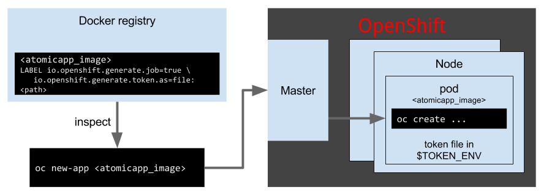

# OpenShift Provider - Native Execution

### Overview

Applications started using the OpenShift provider will result in
applications running in an OpenShift environment after execution. The
OpenShift native execution of an Atomic App relies solely on execution
of an `oc new-app <IMAGE>` command to bootstrap the Atomic App code
within the container image. The Atomic App code within the container
will then execute and call the OpenShift API in order to bring up the
application in the same OpenShift environment.


### Configuration

#### namespace

The namespace that will be used for the application will be detected
from the environment of the installation container that is used to
bootstrap the start of the application. It is not necessary to provide
the namespace in the config.

#### provider-config / provider-api / provider-auth

At the time of execution, the Atomic App container is already running
inside of the openshift environment and has access to the credentials
of the executing user. For this reason, there is no need to specify
the credentials to the application.

### Operations

```
oc new-app <IMAGE>
```

Starts a new pod in OpenShift that will execute Atomic App code and
communicate with the OpenShift API to bring up the application components.


### How It Works

As stated previously, native mode works by executing an Atomic App
container image via the `oc new-app` command. Here is a diagram of how
it works



There are two required labels for OpenShift to run an Atomic App.

1. `io.openshift.generate.job=true`
  * identify the image as an executable job
1. `io.openshift.generate.token.as=env:TOKEN_ENV_VAR`
  * expose the user access token to the container so it can be used to
    execuite OpenShift API calls  

The following workflow is rough overview of how an Atomic App is bootstrapped 
in openshift.

1. The Atomic App image has two metadata LABELs (see above).
1. When `oc new-app` is run the Atomic App image is remotely inspected.
1. The OpenShift Master executes the Atomic App image in order to bootstrap the install.
1. The user's token is passed into the resulting pod as a secret to authorize API calls.
1. The Atomic App pod makes API calls to the OpenShift Master to create or run the application.

